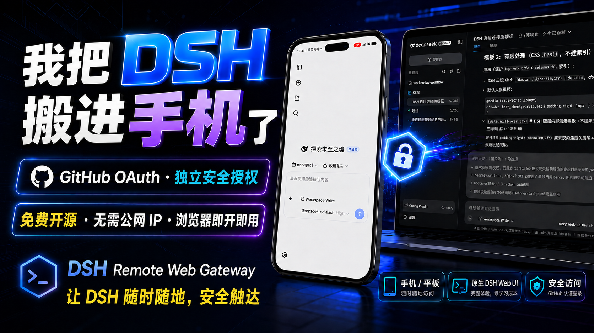
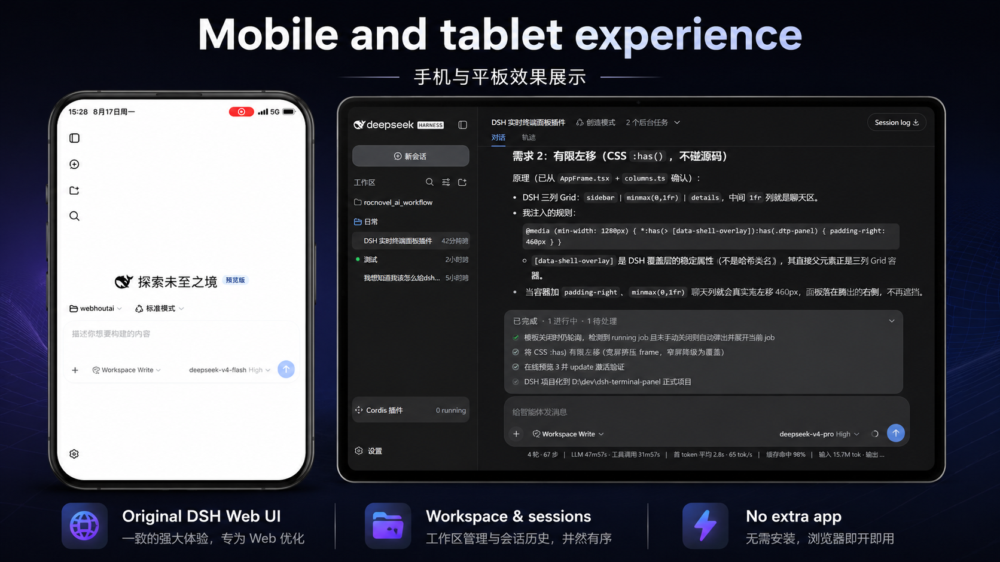
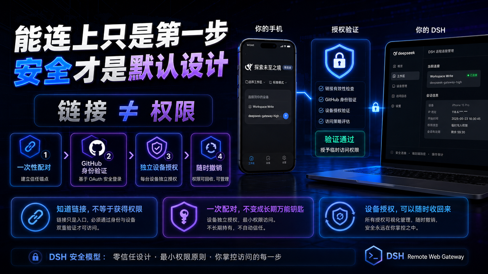
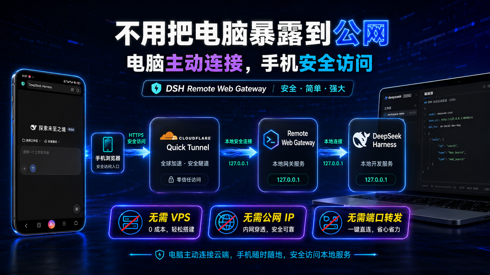
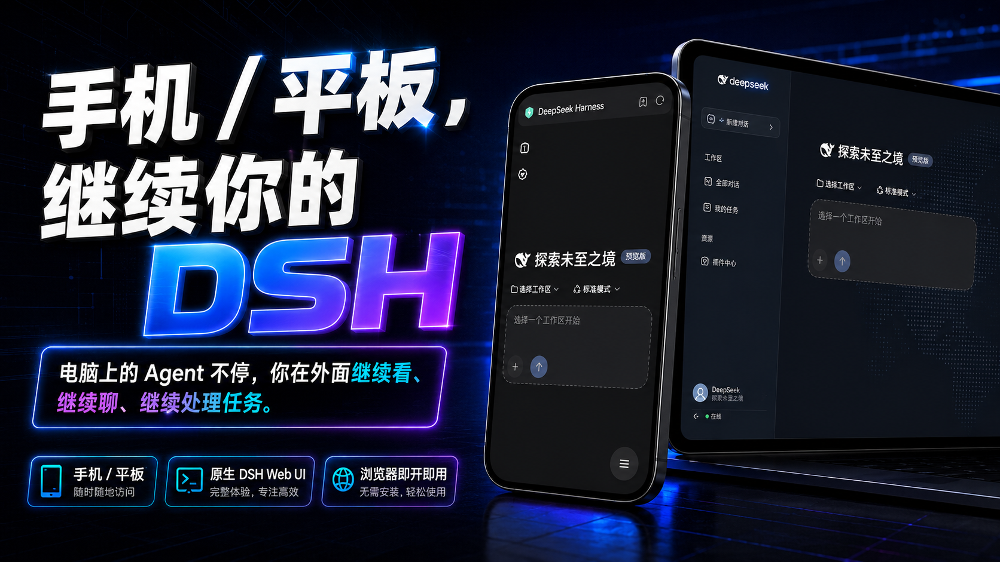

<div align="right">

[简体中文](README.md) · English

</div>

# DSH Remote Web Gateway

## **Keep using DeepSeek Harness from your phone.**

### **Scan a code, and the DSH on your computer goes with you.**

### **A link is not permission · One-time pairing · Per-device authorization, revocable anytime**

### **No remote desktop · No SSH · No public IP / port forwarding**


---

## **Your DSH is still working on the computer — and you already left?**

You are on your way home, and the Agent is still running tasks.

You just want to pull out your phone and see:

### **What's it doing? Did it finish?**

Then it stops and waits for your confirmation while you're away.

Or you're already in bed and you suddenly think:

> "I still need to add one more thing to that request."

What you actually want is simple:

### **Open your phone and keep using the exact DeepSeek Harness that is running on your computer.**

**That is what DSH Remote Web Gateway does.**

No need to squeeze your whole Windows desktop into a phone, and no need to deploy a second Agent on your phone.

**Projects, sessions, tools, and Agents stay on the computer.**

## **You simply take DSH with you.**

---

## ⭐ [**Does this project solve your problem? Give it a Star →**](https://github.com/AercherC/dsh-remote)

### **A Star is not a requirement to install, and it changes nothing about the features.**

### It only lets me know:

## **This project is worth maintaining, and it helps more people searching for "DSH on your phone" find it.**

---

# 🚀 **One command, and you're ready**

```bash
dsh plugin --profile web add dsh-remote-web-gateway
```

> 💻 Using **DSH Desktop (Windows GUI)**? The plugin CAN be installed into the Desktop
> `desktop` profile, but only from an EXTERNAL terminal/script while Desktop is closed
> (a running Desktop must not be mutated by a second process): run
> `scripts\install-windows.ps1 -TarballPath <local-tgz>`, then restart DSH Desktop.
> See [Windows/Desktop install notes](docs/WINDOWS_DESKTOP_INSTALL.md).

### After installing:

## **Restart DSH → Settings → Remote Control → Enable remote control → Scan with your phone**

**That's it.**

### 📘 [**First time? Open the User Guide →**](docs/USER_GUIDE_EN.md)

Install, pairing, a second device, revoking access, updates, and common issues — all covered step by step.

### 🤖 [**Don't want to install it yourself? Let an AI do it →**](docs/USER_GUIDE_EN.md#ai-assisted-install)

Send the project link and the ready-made prompt from the User Guide to DSH, Codex, Claude Code, or another coding agent.

**An agent that can run your terminal can help install it directly; an agent that cannot touch your computer can still walk you through the official docs step by step.**

---

# **DSH on your phone is not a "miniature Windows"**


Remote desktop solves this question:

> How do I fit my whole computer into a phone screen?

We solve this one:

> ## **How do I keep using DSH after I leave the computer?**

The Agent on your computer keeps working.

From your phone you can:

### **Check progress · Continue conversations · See results · Handle the actions that need your confirmation**

What your phone shows is DSH.

## **Not a Windows desktop that needs endless zooming and dragging.**

---

# **You just want DSH on your phone — do you really need all that hassle?**

### **To glance at your Agent, do you really need to remote into all of Windows?**

No.

## **Take only DSH to your phone.**

### **To reach your computer from your phone, do you really need a VPS, SSH, and router port forwarding first?**

Not by default.

## **One click sets up a Cloudflare Quick Tunnel.**

### **To use DSH from your phone, do you really need to redeploy an Agent?**

No.

## **Keep using the DSH, projects, and tools already running on your computer.**

### **For convenience, should a long-lived token really travel around inside every link?**

We chose a different way:

## **One-time pairing + per-device authorization + revoke anytime.**

---

# **Getting connected is only the first step. Security is the default design.**



Making DSH reachable from a phone is not that hard.

**A reverse proxy plus a tunnel** can get a Web UI onto a phone quickly.

What is actually hard:

## **Who gets in?**

## **What happens when a credential leaks?**

## **Can an authorized device be un-authorized later?**

Because behind DSH is not an ordinary web page.

It can reach:

**Your project source code, development files, local tools, and the model capabilities you have configured.**

If this is a company development machine, an overly simple remote entry risks more than "someone sees a page".

It can expose your development environment.

Someone could even keep calling the model quota you already paid for.

### **Waking up to a drained API quota is only one of the milder outcomes.**

So we never treated:

> "the phone can open it"

as:

> "remote access is done".

The whole access flow looks more like:

```text
Temporary connection
    ↓
One-time pairing
    ↓
Per-device authorization
    ↓
Continuous authentication
    ↓
Revoke anytime
    ↓
DeepSeek Harness
```

## **A link is not permission.**

Having the address does not mean you have control of DSH.

## **The pairing credential is not a long-lived password.**

First pairing uses a one-time credential instead of a universal long-lived token riding along in every QR code and link.

## **Every device is authorized independently.**

Not every phone shares one long-lived master key.

## **Authorization can be taken back.**

A device no longer trustworthy?

**Revoke it from the computer.**

For the full security boundary — what we protect against and what we don't:

For the full security boundary — what we protect, what we trust, and what we do not — see the "Security" section of the [User Guide](docs/USER_GUIDE_EN.md).

---

# **A reverse proxy could do it — why did we make it this complex?**

Because a minimal implementation mainly solves:

> ## **How do I open this page from the outside?**

We also wanted to solve:

> ## **How do I make it actually suitable for long-term remote use?**

So beyond the connection, we added:

**One-time pairing · per-device Device Sessions · single / global revocation · HTTP / WebSocket authentication · a loopback-only management plane**

We would rather make this slightly more complex.

## **Than mistake "it opens" for "it is safe to trust".**

---

# **How does it actually connect?**


```text
Phone browser
     │
     │ HTTPS
     ▼
Cloudflare Quick Tunnel
     │
     ▼
DSH Remote Web Gateway
     │
     │ 127.0.0.1
     ▼
DeepSeek Harness
```

The computer establishes the Tunnel outbound.

## **DeepSeek Harness and the Gateway still listen only on the local machine.**

So by default you need no public IP, and no new inbound port on your router.

---

# **The capabilities you will actually use**

### 📱 **Phone-tailored UI**
Not a desktop UI squeezed onto a phone.

### ⚡ **One-click Quick Tunnel**
No VPS, SSH, or port forwarding by default.

### 🔐 **One-time QR scan / 8-digit pairing code**
First-time device access, simple and direct.

### 📱 **Per-device authorization**
Multiple devices each get their own access rights.

### 🚫 **Revoke anytime**
Take back access from a single device or from all devices, right from the computer.

### 🌐 **Automatic network adaptation**
Uses the system / environment proxy, and falls back to verified mirror paths when the official download is failing.

### 🔄 **Update reminders**
You are notified when a new version exists; you confirm the install, and your working DSH is never restarted behind your back.

---

# 📚 **Documentation**

### 📘 [**User Guide**](docs/USER_GUIDE_EN.md)
**Start here if it's your first time.**

It also includes copy-paste prompts for installing / troubleshooting with an AI.

### 🧰 [**Troubleshooting**](docs/TROUBLESHOOTING.md)
Common issues with the tunnel, downloads, pairing, network, and updates.

### 🧰 [**Windows / DSH Desktop install**](docs/WINDOWS_DESKTOP_INSTALL.md)
One-click install and rollback on DSH Desktop (Windows GUI).

### 📋 [**CHANGELOG**](CHANGELOG.md)
Version changes and update contents.

---

# 🤖 **Stuck? Hand the project link to an AI**

```text
https://github.com/AercherC/dsh-remote
```

Send:

### **The project link + your error message / screenshot**

to DSH, Codex, Claude Code, or another AI.

Tell it:

> **First read this project's README, User Guide, and Troubleshooting, then help me debug according to the project's current docs.**

### 🤖 [**Have an AI install / debug for you →**](docs/USER_GUIDE_EN.md#ai-assisted-install)

---

# **Open source**

This project will always stay **free and open source**.

If it saved you a remote-desktop hassle, a VPS, or just let you keep using DSH comfortably after work —

that is already worth it.

If it helped you too, please leave a ⭐ on this project:

### ⭐ [**Star dsh-remote →**](https://github.com/AercherC/dsh-remote)

This project is licensed under the [MIT License](LICENSE).

**DSH Remote Web Gateway (dsh-remote) is a community open-source project.**

---

# ⭐ **If it actually got you away from your desk, please leave a Star**



The Agent on your computer keeps running.

You have already left the office.

And you finish the task from your phone.

## **That is what this project is for.**

### ⭐ [**Please remember to Star DSH Remote Web Gateway so more DSH users can find it →**](https://github.com/AercherC/dsh-remote)
