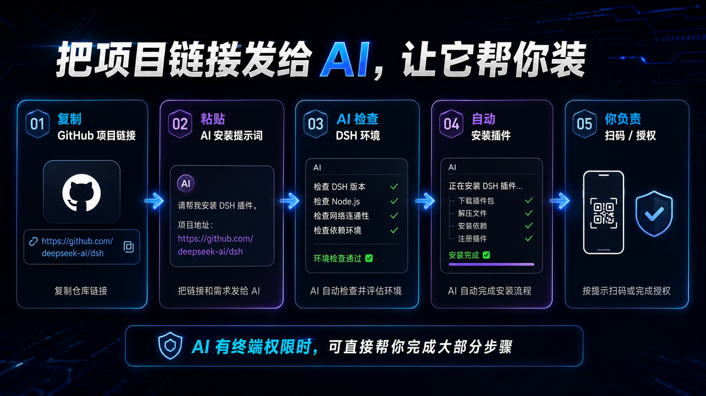
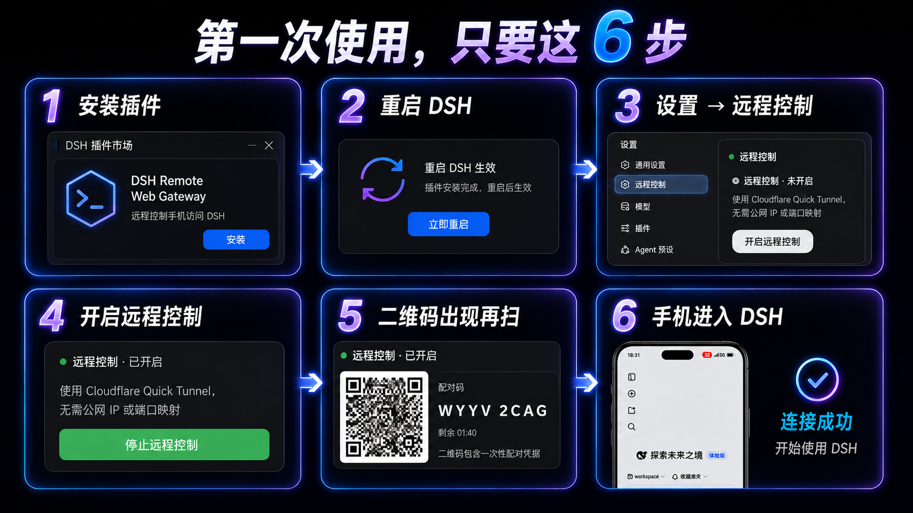
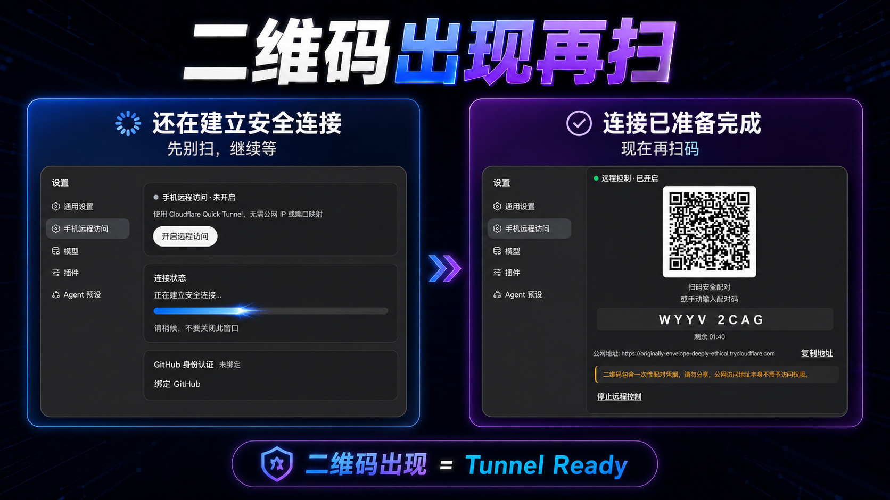
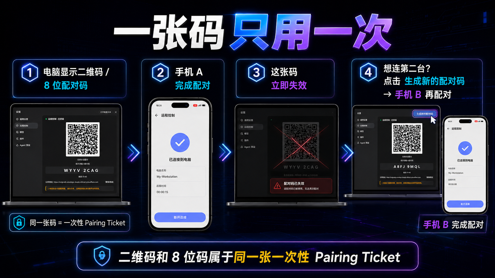
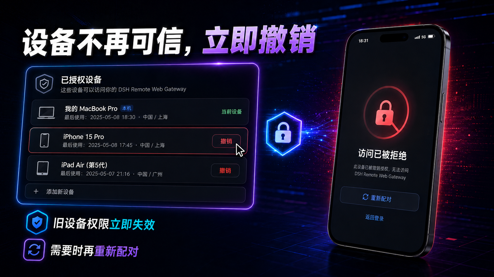
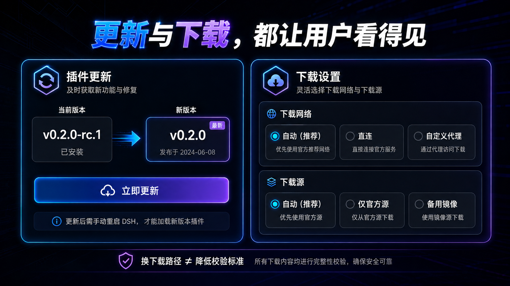

[简体中文](USER_GUIDE.md) · English

# DSH Remote Web Gateway — User Guide

> **Remote DeepSeek Harness from your phone — from install to first scan, this one page is enough.**

If this is your first time, you don't need to understand Quick Tunnel, Gateway, Device Session, or any of that first.

**Install it and use it.**

Come back to the relevant section when you hit a problem.

---

<a id="ai-assisted-install"></a>

# 🤖 Don't want to read docs? Send the project link to an AI

This is the recommended path for beginners.



If you are using:

**DSH, Codex, Claude Code, or any coding agent that can read GitHub**

you don't even need to work through this guide from scratch.

First, copy the project URL:

```text
https://github.com/AercherC/dsh-remote
```

Then copy the full prompt below to your AI.

## 📋 AI install prompt

```text
I want to install and configure on this computer:

DSH Remote Web Gateway

Project URL:
https://github.com/AercherC/dsh-remote

Please first read the latest:

1. README
2. docs/USER_GUIDE.md
3. docs/TROUBLESHOOTING.md

from this project, then start working.

Requirements:

1. Do not guess the installation method from your historical knowledge; always follow the project's current repository docs and my actual environment.
2. First check whether my DeepSeek Harness / DSH is installed, its version, the Web profile, and whether it is running.
3. If my environment meets the requirements, install DSH Remote Web Gateway the official way.
4. You may directly execute steps that are safe to automate.
5. For steps that require me personally, such as:
   - scanning a QR code
   - entering a pairing code
   - clicking confirm
   - restarting DSH
   stop and clearly tell me what to do.
6. Do not modify DeepSeek Harness core source code.
7. Do not delete my DSH_HOME, configuration, sessions, projects, or other plugins in order to install this plugin.
8. Do not run destructive operations such as reset, clean, bulk delete, changing the system PATH, or killing unknown processes.
9. If installation fails:
   - first read this project's Troubleshooting
   - then debug from the real error
   - do not suggest reinstalling all of DSH.
10. Never output my cookies, tokens, GitHub verification details, proxy passwords, or other secrets in chat or logs.
11. After installation, help me confirm:
    - the plugin is loaded by DSH correctly
    - the settings page shows "Remote Control"
    - the "Enable remote control" button is visible
12. Stop at the step where the phone needs to scan the QR code, and let me scan and authorize myself.

First tell me what DSH environment you found, then start installing.
```

---

## What's the difference between an AI that can run your terminal and one that can't?

### The AI can operate your computer

For example a local coding agent.

It can help with:

**Checking DSH → running the install command → verifying the plugin → starting / restarting DSH → debugging errors.**

At the steps that need your confirmation — such as scanning — it hands over to you.

### The AI is just a chat bot

That's fine too.

Send it the project link and ask it to read the project docs.

It can still:

**Tell you step by step which command to copy, which page to open, and which button to click.**

The only difference:

> It cannot operate your computer for you — you follow its steps yourself.

---

# 🚀 No AI? Installing it yourself is only a few steps

The whole first-time flow is:

## **Install the plugin → restart DSH → enable remote control → wait for the QR code → scan with your phone**


Step by step below.

---

# 1. What do you need before installing?

The officially verified host environment is:

**Windows x64**

The plugin requires a compatible DSH version starting from:

```text
0.1.0-rc.5+
```

The project's current primary development and real-acceptance baseline is:

```text
DeepSeek Harness 0.1.0-rc.7
```

If you are on a newer version, check the plugin's Compatibility doc to be safe.

### 📘 [See the compatibility notes](COMPATIBILITY.md)

---

# 2. One-command install

```bash
dsh plugin --profile web add dsh-remote-web-gateway
```

After installing:

## **Restart DSH Web.**

If you already know how to start DSH, start it the way you usually do.

The standard entry is:

```bash
dsh web
```

Then open your DSH Web in a browser.

By default it is usually:

```text
http://127.0.0.1:3080/
```

---

# 3. Find "Remote Control"

Open DeepSeek Harness.

Go to:

## **Settings → Remote Control**

You should see:

# **Enable remote control**

If "Remote Control" is completely absent, don't start fiddling with the network.

Check these first:

- whether the plugin installed successfully;
- whether it was installed into the `web` profile;
- whether DSH was restarted;
- whether the plugin loaded.

If it's still missing, go straight to:

### 🧰 [Troubleshooting](TROUBLESHOOTING.md)

---

# 4. Click "Enable remote control"



The QR code does not necessarily appear immediately after you click.

That's normal.

You may see these in sequence:

> Preparing a secure connection…

> Checking cloudflared…

> Creating the Cloudflare Tunnel…

> Starting the secure connection…

> Waiting for the public address…

> Establishing the secure connection…

On first use, if there is no usable `cloudflared` on the computer yet, the plugin may also need to download it first.

## **Don't scan the moment you see "Establishing".**

We deliberately added a Tunnel Ready check.

The QR code only appears once the remote connection is confirmed ready:

# **The QR code appears only then.**

In other words:

> **QR code visible = this is when you should scan.**

---

# 5. First scan with your phone

Once remote control is ready, the settings page on the computer shows:

- the QR code;
- an 8-digit pairing code;
- remaining valid time;
- the current access address.

Scan the QR code with your phone.

The browser opens the pairing page.

Then the first device pairing completes.

After a successful pairing you will see:

# **Device paired successfully**

The QR code, 8-digit pairing code, and countdown on the computer's settings page disappear.

That's normal.

The QR code isn't broken.

It's:

## **Done with its job.**

---

# 6. Can't scan? Use the 8-digit pairing code

The QR code and the 8-digit pairing code are just two ways to enter the same thing.

If it's inconvenient to scan:

1. Open the current access address shown on the computer's settings page in your phone browser;
2. Go to the pairing page;
3. Enter the **8-digit pairing code** shown on the computer;
4. Pairing completes.

The QR code and the 8-digit code belong to:

## **The same one-time pairing credential.**

Not two separate permissions.

---

# 7. Why can't I use that QR code anymore?

On purpose.



The first pairing uses:

# **A one-time Pairing Ticket**

It only stays valid for a short time by default.

The current default is:

## **5 minutes.**

Both the QR code and the 8-digit pairing code belong to that one Ticket.

After either one is used successfully:

# **The whole Ticket is invalidated immediately.**

So:

- a QR code that was scanned cannot pair a second phone;
- an 8-digit code that was used cannot be entered again;
- refreshing the settings page on the computer will not quietly mint a fresh credential for you.

This is designed to avoid:

> A QR code that was shared, screenshotted, or left in a chat log becoming a long-lived master key into DSH.

> **Note: an unused QR / pairing code that is still within its validity period is still a real credential.**
>
> Don't send it to anyone.

---

# 8. Want to connect a second phone?

Simple.

After the first device pairs successfully, the settings page shows:

# **Generate new pairing code**

Click it.

The plugin creates a new Pairing Ticket.

Then the second device:

**Scans / enters the new 8-digit code → gets its own independent authorization.**

Each device gets its own Device Session.

Not all phones share one long-lived master key.

---

# 9. Which devices are authorized?

In:

## **Settings → Remote Control → Authorized devices**

you can see the currently authorized devices.

Device info includes things like:

- device name;
- browser / User-Agent info;
- last used time.

The default maximum is:

## **20 authorized devices.**

That's far more than enough for personal use.

---

# 10. Lost your phone? Revoke it now



This is one of the most important steps in remote access.

If a phone:

- is lost;
- was lent to someone;
- is no longer used;
- you suspect is compromised;

go back to the computer:

## **Settings → Remote Control → Authorized devices**

find that device.

Click:

# **Revoke**

After revoking:

## **The old device's access stops working immediately.**

Its previous authorization can no longer be used.

---

# 11. Not sure which device? Revoke everything

If you're not sure which device has a problem:

click:

# **Revoke all devices**

It asks for confirmation:

> Revoke every device? All phones will need to pair again.

After confirming:

**Every authorized device must pair again.**

---

# 12. How do I stop remote control?

Not using it for now?

Go back to:

## **Settings → Remote Control**

click:

# **Stop remote control**

While a connection is still being established, you can also click:

# **Stop**

After stopping, don't keep using the previous temporary address or old QR code.

Next time, re-enable remote control and use the status and address shown on the settings page at that moment.

---

# 13. How do I update the plugin?



The plugin checks for new versions periodically.

If an update is found:

go to:

## **Settings → Remote Control → Plugin updates**

You will see:

- the current version;
- the new version;
- the release notes.

After reviewing, click:

# **Update now**

When the install finishes you'll see:

> **Update installed — restart DSH to apply.**

Note:

# **The plugin never restarts your DSH behind your back.**

Running an Agent?

Finish your work first.

Then restart when it suits you.

If the update fails:

**The current version keeps running.**

A failed update won't break the plugin you already have.

---

# 14. Why might the first startup need to download Cloudflare Tunnel?

DSH Remote Web Gateway uses by default:

# **Cloudflare Quick Tunnel**

The computer needs a `cloudflared` client to establish this temporary secure channel.

If the current environment has no compliant version:

the plugin prepares it automatically.

So the first time you enable remote control, it can be a bit slower than later.

You may see:

> Downloading Cloudflare Tunnel…

with:

- bytes downloaded;
- the current network route;
- the current download source.

---

# 15. The download is slow — what now?

Don't go hunting for an .exe on GitHub yourself.

The plugin already provides:

## Download network

- **Auto (recommended)**
- Direct
- Custom proxy

and:

## Download source

- **Auto (recommended)**
- Official source only
- Backup mirrors

Keep it on:

# **Auto (recommended)**

Auto mode picks a usable path based on your current Windows network environment.

If the official download fails, the first byte never arrives, or the speed is abnormal:

the plugin can try the reviewed backup download paths.

---

## Does "backup mirror" mean downloading a different version?

No.

A backup mirror only solves:

> **Where the same file is downloaded from.**

Using a mirror never skips security verification.

After the download, the fixed-version and integrity checks still run.

So:

> **Changing the transport path ≠ lowering the verification standard.**

---

# 16. My company proxy needs a username and password

The custom proxy setting:

**does not store proxy usernames or passwords.**

If your network requires an authenticated proxy, use an environment proxy variable such as:

```text
HTTPS_PROXY
```

Don't paste:

- usernames;
- passwords;
- tokens;

into public screenshots, Issues, or chat logs.

---

# 17. Common situations

## I clicked "Enable remote control" and the QR code didn't appear immediately

Look at the status.

If it still says:

> Establishing the secure connection…

**Keep waiting.**

The QR code only appears after the Tunnel is truly Ready.

---

## The phone opens Cloudflare 1033 after the QR code appeared

In the normal build:

**The QR code only appears after the Tunnel is Ready.**

If you still hit 1033:

1. Don't spam refresh;
2. Go back to the computer and stop remote control;
3. Enable it again;
4. If it reproduces, hand the error-page time, DSH logs, and the symptom to Troubleshooting / an AI.

### 🧰 [See Troubleshooting](TROUBLESHOOTING.md)

---

## It says "Device paired successfully" and the QR code is gone

Normal.

The Ticket has been used.

To connect a second device:

# **Click "Generate new pairing code".**

---

## It says "Pairing code expired"

Normal.

One-time pairing credentials have a validity period.

Click:

# **Generate new pairing code**

and pair again.

---

## A revoked phone suddenly gets 401 / can't access

Normal.

Revoking exists to:

# **Instantly take back that device's access.**

Re-authorizing requires pairing again.

---

## cloudflared download failed

First:

1. Check your network;
2. Keep "Auto (recommended)" and retry;
3. See whether the system proxy was detected;
4. If needed, try a custom proxy or a backup download source.

Don't fix it by:

- deleting your whole DSH_HOME;
- reinstalling Node;
- changing the system PATH;
- downloading some unknown cloudflared from anywhere.

---

## Update check says "Update check is unavailable"

If the npm registry is unreachable (or you installed a local build that was never published to the registry), you may see this.

It doesn't affect:

**the already-installed version continuing to run.**

---

## "An existing Cloudflare configuration was detected"

Don't delete your Cloudflare configuration files the moment you see this.

If your computer already runs another Cloudflare Tunnel:

### 🧰 First read [Troubleshooting](TROUBLESHOOTING.md)

Only handle it after confirming there is a real conflict.

---

<a id="ai-troubleshooting"></a>

# 🤖 19. Still stuck? Hand the project link + error to an AI

Don't just say:

> "This plugin is broken, fix it."

Too little information — the AI will guess from its own experience.

Give it:

1. the project URL;
2. the current error;
3. a screenshot;
4. the DSH version;
5. what you just did;

Then copy the prompt below.

## 📋 AI troubleshooting prompt

```text
I am using:

DSH Remote Web Gateway

Project:
https://github.com/AercherC/dsh-remote

The problem I am having:

[write your problem here]

Error / logs:

[paste logs that contain no tokens, cookies, passwords, or other sensitive info]

Please first read the project's latest:

1. README
2. docs/USER_GUIDE.md
3. docs/TROUBLESHOOTING.md

then analyze.

Requirements:

1. Do not guess the current project implementation from historical knowledge.
2. First determine which layer the problem is in:
   - DSH / plugin loading
   - cloudflared download
   - Quick Tunnel
   - Pairing
   - Device Session
   - Update
   - Network / proxy
3. Prefer read-only checks to confirm the real state.
4. Do not delete DSH_HOME, the plugin directory, user configuration, or sessions directly.
5. Do not run destructive operations such as git reset / clean, bulk delete, changing the system PATH, or killing unknown processes.
6. If you really need to modify or delete something, first tell me:
   - what to change
   - why
   - the risk
   - how to recover
   and wait for my confirmation.
7. Do not ask me to expose:
   - Cookies
   - Pairing Secret
   - GitHub Token
   - API Key
   - Proxy passwords
8. If a screenshot or log may contain sensitive info, warn me to redact it first.
9. If the project's Troubleshooting already covers the problem, follow the official docs first.
10. Finally tell me:
    - the root cause
    - what you did
    - whether it is fixed
    - whether any risk remains

Analyze first; do not run destructive operations yet.
```

---

# 18. Before sharing screenshots / asking for help, check for sensitive info

In particular, never share:

- a currently valid QR code;
- a currently valid 8-digit pairing code;
- the Pairing Secret;
- the Device Cookie;
- a GitHub Device Code;
- an API Key;
- a proxy password;
- company project paths or source code.

If you must share a screenshot:

# **Stop remote control first, or wait for the current Pairing Ticket to expire, then share.**

---

# 19. Want to understand why it's designed this way?

Regular usage ends here.

If you want to know why it's designed this way:

### 🧰 [Troubleshooting](TROUBLESHOOTING.md)

Look up real symptoms.

### 💻 [Compatibility](COMPATIBILITY.md)

Which systems and devices are actually verified.

---

# Three things to remember

## **Scan only when the QR code appears.**

Before that, the secure connection is still being established.

## **Don't share a pairing code while it's still valid.**

It's one-time, but before it's used it is still a real credential.

## **If a device is no longer trustworthy, revoke it.**

Remote access is not something you hand out and can never take back.

**You can always manage your authorized devices from the computer.**
